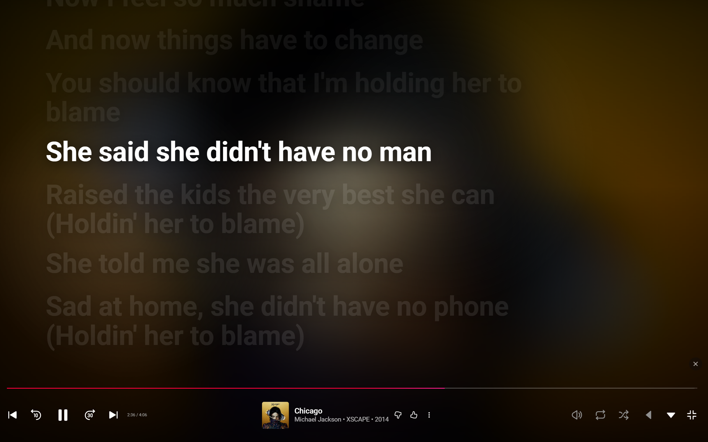

# FlowLyrics

FlowLyrics is an unpacked Chrome extension for YouTube Music that replaces the static lyrics pane with smooth, synced lyrics when LRCLIB has timing data for the current track.

Download the latest extension ZIP:
[FlowLyrics-0.5.9.zip](FlowLyrics-0.5.9.zip)

## Preview

<table>
  <tr>
    <td><strong>YouTube Music</strong></td>
    <td><strong>FlowLyrics</strong></td>
  </tr>
  <tr>
    <td></td>
    <td></td>
  </tr>
</table>

### Fullscreen Mode


## Features

- Synced lyrics from LRCLIB when timed lyrics are available.
- Native fallback to YouTube Music lyrics when synced lyrics are unavailable.
- Smooth active-line highlighting and automatic scrolling.
- Click any synced lyric line to seek to that moment.
- Fullscreen lyrics mode for a larger karaoke-style player view.
- Timing offset controls for songs that feel slightly early or late.
- No analytics, accounts, or custom tracking server.

## Offset Controls


Use the offset controls to nudge lyric timing by `0.1s` or `1s`. The center value resets the offset to `0.0s`, and your preference is saved locally in Chrome.

## Install

1. Download [FlowLyrics-0.5.9.zip](FlowLyrics-0.5.9.zip).
2. Extract the ZIP somewhere you will keep it.
3. Open Chrome and go to `chrome://extensions`.
4. Enable Developer mode.
5. Click Load unpacked.
6. Select the extracted folder that contains `manifest.json`.
7. Open or refresh [YouTube Music](https://music.youtube.com).
8. Open the full player and click YouTube Music's Lyrics tab.

Do not delete the extracted folder after installing. Chrome loads the extension directly from that folder.

## Development

For local development, load the source folder directly:

1. Open `chrome://extensions`.
2. Enable Developer mode.
3. Click Load unpacked.
4. Select the `src` folder.
5. Refresh YouTube Music after code changes.

To rebuild the release ZIP:

```powershell
.\scripts\package-extension.ps1
```

## Repository Layout

- `src/` contains the unpacked Chrome extension source.
- `scripts/package-extension.ps1` builds the release ZIP from `src/`.
- `FlowLyrics-<version>.zip` is the downloadable extension package.

## Privacy

FlowLyrics runs only on `https://music.youtube.com/*`. It reads the current track information from YouTube Music and requests matching lyrics from LRCLIB. It does not require a login, does not collect analytics, and does not send browsing history to a custom server.

## Limitations

- Synced lyrics appear only when LRCLIB has synced LRC lyrics for the current track.
- Plain or estimated lyrics are not rendered by the extension.
- When synced lyrics are unavailable, YouTube Music's default static lyrics remain visible.
- Because FlowLyrics is installed as an unpacked extension, Chrome may show developer-mode warnings.

FlowLyrics uses LRCLIB's public lyrics API. Some tracks will not have synced lyrics.
