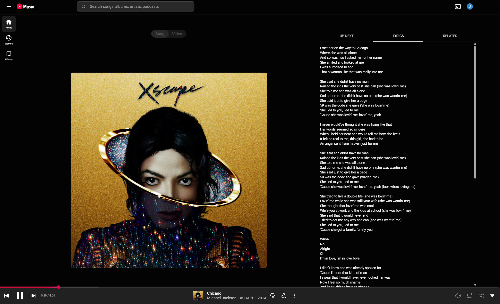
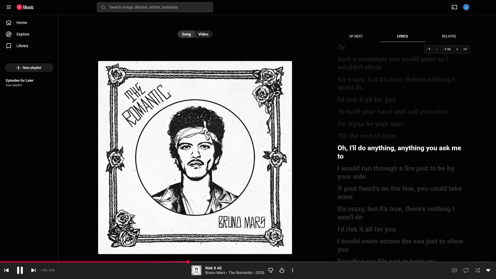
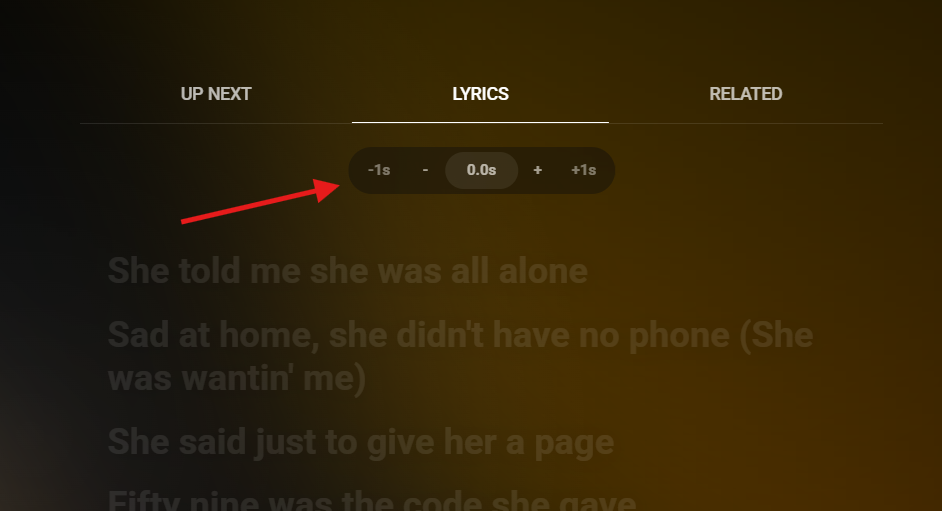

# FlowLyrics

Download the extension ZIP:
[FlowLyrics-0.4.1.zip](FlowLyrics-0.4.1.zip)

FlowLyrics replaces YouTube Music's static Lyrics tab with animated synced lyrics when LRCLIB has timing data. If synced lyrics are not available, YouTube Music's own lyrics stay visible.

<table>
  <tr>
    <td><strong>Before</strong></td>
    <td><strong>FlowLyrics</strong></td>
  </tr>
  <tr>
    <td></td>
    <td></td>
  </tr>
</table>

Click any synced lyric line to jump to that moment in the song.

## Offset

If lyrics feel slightly early or late, use the offset controls to nudge timing by `0.1s` or `1s`. The center value resets to `0.0s`, and your offset is saved locally.

## Install

1. Download the ZIP above.
2. Extract it somewhere you want to keep the extension.
   - Do not delete the extracted folder after installing. Chrome loads the extension from that folder.
3. Open Chrome and go to:
   `chrome://extensions`
4. Enable Developer mode in the top-right corner.
5. Click Load unpacked.
6. Select the extracted folder that contains `manifest.json`.
7. Open or refresh:
   `https://music.youtube.com`

Open the full player and click YouTube Music's Lyrics tab.

## Repository Layout

- `src/` contains the unpacked Chrome extension source. For local development, load this folder in Chrome.
- `FlowLyrics-<version>.zip` is the downloadable extension package at the repository root.
- `scripts/package-extension.ps1` rebuilds the release ZIP from `src/`.

This keeps the source clean while making the downloadable ZIP the first thing people see.

## Development Install

For local development, load the source folder directly:

1. Open `chrome://extensions`.
2. Enable Developer mode.
3. Click Load unpacked.
4. Select this folder:
   `src`
5. Refresh YouTube Music after code changes.

## Privacy

The extension runs only on `https://music.youtube.com/*`. It reads the current track information from YouTube Music and requests matching lyrics from LRCLIB. It does not require a login, does not collect analytics, and does not send browsing history to a custom server.

## Limitations

- Synced lyrics are only shown when LRCLIB has synced LRC lyrics for the current track.
- Plain or estimated lyrics are not rendered by the extension.
- When synced lyrics are unavailable, YouTube Music's default static lyrics remain visible.
- Since this is installed as an unpacked extension, Chrome may show developer-mode warnings.

This uses LRCLIB's public lyrics API. Some tracks will not have synced lyrics; those tracks keep YouTube Music's default static lyrics view.
